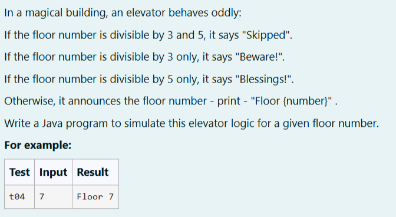
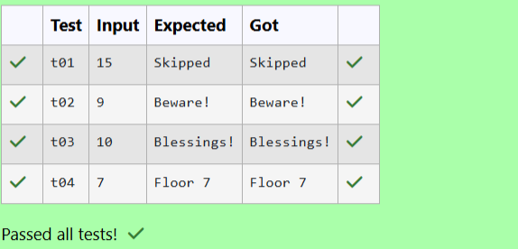

# Ex. No:1(B) CONDITIONAL STATEMENT

## QUESTION:



## AIM:

To Write a Java program to simulate this elevator logic for a given floor number.


## ALGORITHM :
1. Start the program.

2. Read an integer value a from the user.

3. Check if a is divisible by both 3 and 5; if true, print "Skipped".

4. Otherwise check if a is divisible by 3 print "Beware!", else if divisible by 5 print "Blessings!".

5. If none of the above conditions are satisfied, print "Floor " + a and stop the program.


## PROGRAM:
 ```
Program to implement a conditional statement using Java
Developed by: LAKSHMIDHAR N
RegisterNumber:  212224230138
```

## SOURCE CODE:

```java
import java.util.Scanner;
public class Main
{
    public static void main(String args[])
    {
        Scanner sc = new Scanner(System.in);
        int a = sc.nextInt();
        if ((a%3==0) && (a%5==0))
        {
            System.out.println("Skipped");
        }
        else if(a%3==0)
        {
            System.out.println("Beware!");
        }
        else if(a%5==0)
        {
            System.out.println("Blessings!");
        }
        else
        {
            System.out.println("Floor "+a);
        }
    }
}
```


## OUTPUT:



## RESULT:

Thus, thr Java program to simulate this elevator logic for a given floor number has been executed Successfully.