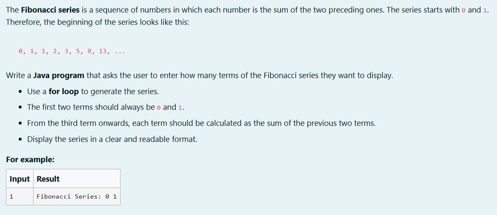
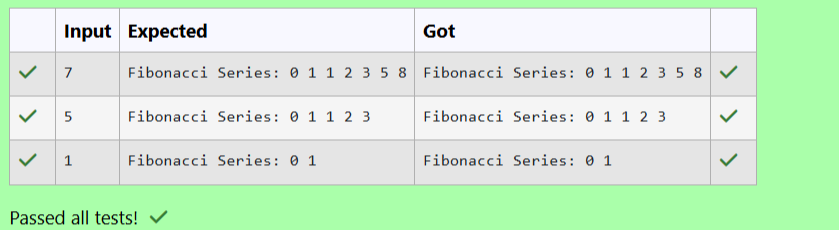

# Ex. No:1(C) LOOPING STATEMENT

## QUESTION:



## AIM:

To write a Java program that reads the number of terms from the user and displays the Fibonacci series using a for loop.      

## ALGORITHM :
1. Start the program and read the number of terms n from the user.

2. Initialize the first two Fibonacci numbers a = 0 and b = 1.

3. Display the first two terms 0 and 1.

4. Use a for loop from 3 to n to calculate the next term c = a + b and print it.

5. Update a = b and b = c in each iteration and stop the program after printing all terms.


## PROGRAM:
 ```
Program to implement a Looping Statement using Java
Developed by: LAKSHMIDHAR N
RegisterNumber: 212224230138
```

## SOURCE CODE:

```java
import java.util.Scanner;
public class Main
{
    public static void main(String args[])
    {
        Scanner sc = new Scanner(System.in);
        int n = sc.nextInt();
        int a=0,b=1,c;
        System.out.print("Fibonacci Series: ");
        if (n == 1) {
            System.out.print(a + " " + b);
            return;
        }
        System.out.print(a + " " + b + " ");
        for (int i=3;i<=n;i++)
        {
            c=a+b;
            System.out.print(c+" ");
            
            a=b;
            b=c;
            
        }
    }
}
```


## OUTPUT:



## RESULT:

Thus, the Java program that reads the number of terms from the user and displays the Fibonacci series using a for loop has been executed successfully.