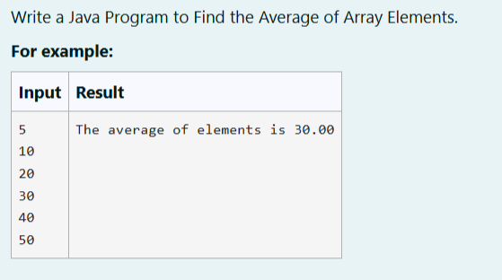
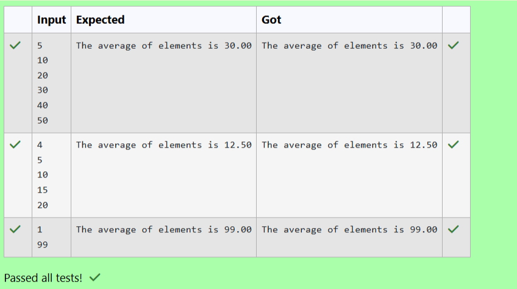

# Ex. No:1(D) ARRAYS

## QUESTION:



## AIM:

To write a Java Program to Find the Average of Array Elements.


## ALGORITHM :
1. Start the program and read the number of elements n from the user.

2. Create an integer array of size n and initialize sum = 0.

3. Use a loop to read n elements and store them in the array while adding each element to sum.

4. Calculate the average using average = (float) sum / n.

5. Display the average value formatted to two decimal places and stop the program.


## PROGRAM:
 ```
Program to implement a Array concept using Java
Developed by: LAKSHMIDHAR N
RegisterNumber: 212224230138
```

## SOURCE CODE:

```java
import java.util.Scanner;
public class Main
{
    public static void main(String args[])
    {
        Scanner sc = new Scanner(System.in);
        int n = sc.nextInt();
        int arr[] = new int[n];
        int sum=0;
        for (int i=0;i<n;i++)
        {
            arr[i] = sc.nextInt();
            sum+=arr[i];
        }
        float res = (float) sum/n;
        System.out.printf("The average of elements is %.2f",res);
        
    }
}
```


## OUTPUT:



## RESULT:

Thus, the Java Program to Find the Average of Array Elements has been executed Successfully.