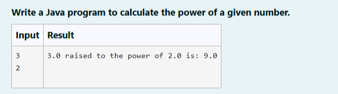
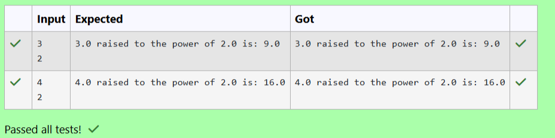

# Ex. No:1(E) STRINGS AND MATH FUNCTION

## QUESTION:



## AIM:

To write a Java program to calculate the power of a given number.


## ALGORITHM :
1. Start the program and create a Scanner object to read user input.

2. Read two double values a (base) and b (exponent) from the user.

3. Calculate the power using Math.pow(a, b).

4. Display the result in the format "a raised to the power of b is: result".

5. Stop the program.


## PROGRAM:
 ```
Program to implement a Strings and Math Function using Java
Developed by: LAKSHMIDHAR N
RegisterNumber:  212224230138
```

## SOURCE CODE:

```java
import java.util.Scanner;
public class Main
{
    public static void main(String args[])
    {
        Scanner sc = new Scanner(System.in);
        double a = sc.nextDouble();
        double b = sc.nextDouble();
        System.out.println(a+ " raised to the power of "+b+" is: "+Math.pow(a,b));
    }
}
```


## OUTPUT:



## RESULT:

Thus, the Java program to calculate the power of a given number has been executed successfully.