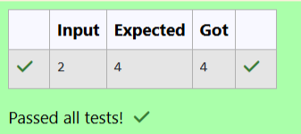

# Ex. No:2(B) METHODS

## QUESTION:


## AIM:

To write java program to create a method int square(int number) that returns the square of a given number.


## ALGORITHM :
1. Start the program and define a method square() to calculate the square of a number.

2. Create a Scanner object and read an integer n from the user.

3. Call the square(n) method and store the returned result.

4. Display the square of the number on the screen.

5. Stop the program.


## PROGRAM:
 ```
Program to implement a Methods using Java
Developed by: LAKSHMIDHAR N
RegisterNumber:  212224230138
```

## SOURCE CODE:

```java
import java.util.Scanner;
public class main
{
    static int square(int number)
    {
        int res = number * number;
        return res;
    }
    public static void main(String args[])
    {
        Scanner sc =new Scanner(System.in);
        int n = sc.nextInt();
        int res = square(n);
        System.out.println(res);
    }
}
```


## OUTPUT:



## RESULT:

Thus, the Java program to create a method int square(int number) that returns the square of a given number has been executed successfully.
