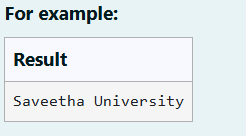
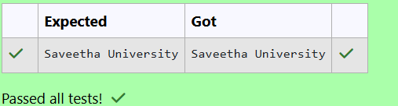

# Ex. No:2(E) ACCESS MODIFIERS

## QUESTION:




## AIM:

To write a Java program to Create a class College with a final variable universityName = "Saveetha University" and  Create objects and print the name.

## ALGORITHM :
1. Start the program and define a College class with a final variable universityName.

2. Assign the value "Saveetha University" to the final variable.

3. In the main method, create an object c1 of the College class.

4. Access the universityName using the object.

5. Display the university name and stop the program.


## PROGRAM:
 ```
Program to implement a Access Modifiers using Java
Developed by: LAKSHMIDHAR N
RegisterNumber:  212224230138
```

## SOURCE CODE:

```java
import java.util.Scanner;
class College 
{
    final String universityName = "Saveetha University";
}

public class prog 
{
    public static void main(String[] args) 
    {
        College c1 = new College();
        System.out.println(c1.universityName);
    }
}
```


## OUTPUT:



## RESULT:

Thus, the Java program to Create a class College with a final variable universityName = "Saveetha University" and  Create objects and print the name has been executed successfully.